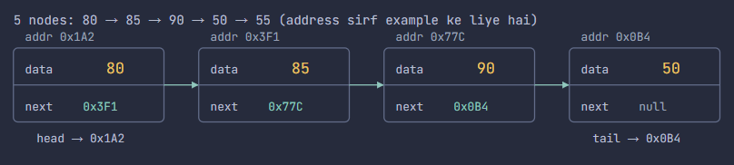
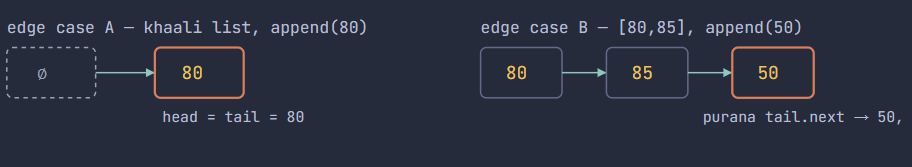
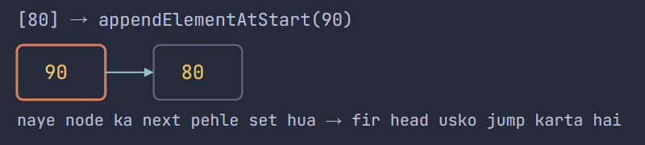
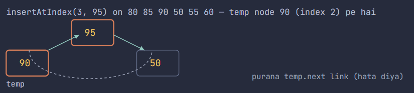
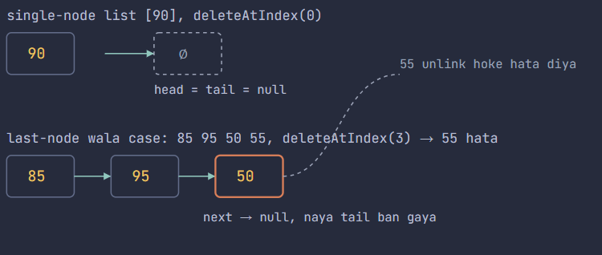

# 🟡Linked list hota kya hai
Array ek continuous memory block mein hota hai — isliye computer seedha index se address nikal ke jump kar leta hai. Linked list isko chhod deta hai jaan-bujh kar: har element (ek node) apni alag jagah memory mein baitha hota hai, aur next node tak pahunchne ka ek hi tarika hai — us node ke andar rakha hua pointer follow karna. Trade-off ye hai: ab index se direct access nahi milega (O(1) nahi raha), lekin beech mein kuch add ya delete karna aasan ho gaya — bas do arrows ko re-point karna hai, poori list shift nahi karni.

**Singly linked** list ka matlab hai har node sirf aage ki taraf point karta hai. Head se tail tak hi chal sakte ho, peeche nahi aa sakte.


# 👉🏻 01 Node ka structure — data + next ka address
Har node mein do cheezein hoti hain: ek value jo tumhe chahiye, aur agle node ka memory address. Last node ka next kisi address ko point nahi karta — null hota hai.



# Index ka Gyan (we assume 0 based indexing)
- Kabhi bhi jb loop run kr rhe ho kahi bhi to , int i = 1 se kr rhe ho kyu 
    - Kyuki , jo temp Node jo banate hai wo phle hi head ke barabar kr dete hai to i = 0 , head ko hona chaiye , per wo hum phle hi assign kr dete hai to loop chlta 1 se haii , 0 ko manually handle krna padta haii

```java 
for (int i = 1; i <= index - 1; i++) {
                temp = temp.next;
            }
```
# 👉🏻 02 Class kaise bana hai
**Node storage ki unit hai:** ek int data field, ek Node next field, jo constructor mein kahin point nahi karta jab tak link nahi hota. LinkedList wrapper hai: isme head, tail, aur size hote hain, aur neeche ke saare functions bas Node objects ke beech next pointers ko rewire karte hain aur in teeno fields ko adjust karte hain.
```java
public static class Node {
        int data;
        Node next;

        public Node(int data) {   //constructor
            this.data = data;
        }

    }
```

# 👉🏻 03 appendElement — tail mein add karna
- **list khaali hai** — head null hai, isliye naya node hi head aur tail dono ban jaata hai
- **list mein kuch hai** — tail.next naye node se jud jaata hai, fir tail us naye node pe shift ho jaata hai


<br>

```java
        void appendElement(int data) {
            Node temp = new Node(data);
            if (head == null) {
                head = temp;
            } else {
                tail.next = temp;
            }
            tail = temp;
            size++;
        }
```


# 👉🏻 04 appendElementAtStart — head mein add karna
- **list khaali hai** — list khali hai mtlb usme kuch nahi so , head aur tail yahi node element banega, seedha appendElement ko call kar deta hai, so head=tail=naya node
- **list mein kuch hai** — naye node ka next purane head pe set hota hai pehle, uske baad hi head shift hota hai — warna baaki poori list kho jaati


```java
 void appendElementAtStart(int data) {
            if (head == null) {
                appendElement(data);
                return;
            }
            Node temp = new Node(data);
            temp.next = head;
            head = temp;
            size++;
        }
```

# 👉🏻 06 insertAtIndex — kahin bhi beech mein daalna
- **index == 0** — appendElementAtStart ko bhej diya jaata hai
- **index == size —** appendElement ko bhej diya jaata hai
- **beech ka index —** temp ko index-1 tak chalaya jaata hai; naye node ka next purane temp.next ko le leta hai, phir temp.next naye node pe point karta hai



```java
        void insertAtIndex(int index, int data) {
            if (index == 0) {
                appendElementAtStart(data);
                return;
            }
            if (index == size) {
                appendElement(data);
                return;
            }
            Node temp = head;
            Node newNode = new Node(data);
            for (int i = 1; i <= index - 1; i++) {
                temp = temp.next;
            }
            newNode.next = temp.next;
            temp.next = newNode;
            size++;

        }
```
# 👉🏻 05 getElement — index se value nikalna
- **index < 0 —** pakad liya jaata hai, "Invalid Index!" print hota hai, -1 return hota hai
- **index >= size —** pakad liya jaata hai, "Index Out of bound!" print hota hai, -1 return hota hai
- **index == 0 —** bina loop chalaye seedha head.data return kar deta hai
- **valid middle/end index** — temp ko index baar aage chalaya jaata hai
```java
        int getElement(int index) {
            if (index < 0) {
                System.out.println("Invalid Index !");
                return -1;
            }
            if (index >= size) {
                System.out.println("Index Out of bound!");
                return -1;
            }
            Node temp = head;
            if (index == 0) {
                return temp.data;
            } else {
                for (int i = 1; i <= index; i++) {
                    temp = temp.next;
                }
            }

            return temp.data;
        }
```

# 07 deleteAtIndex — kahin se bhi remove karna
- **index < 0 ya index >= size —** print hoke ignore ho jaata hai, list waisi hi rehti hai
- **index == 0 —** head seedha head.next pe jump karta hai; agar ye akela hi node tha, to head null ban jaata hai aur tail bhi manually null kiya jaata hai
- **index == size-1 (last node) —** second-last node tak chal ke uska next null kiya jaata hai, wahi node naya tail ban jaata hai
- **beech ka index —** index-1 tak chalke, temp.next = temp.next.next target ko skip kar deta hai



```java
        void deleteAtIndex(int index) {
            Node temp = head;
            if (index < 0) {
                System.out.println("Invalid Index");
            } else if (index >= size) {
                System.out.println("Index Out of Bound");

            } else if (index == 0) {
                head = temp.next;
                if (head == null) { // if only one element present , list now empty so tail empty
                    tail = null;
                }
                size--;

            } else if (index == size - 1) {
                for (int i = 1; i <= index - 1; i++) {
                    temp = temp.next;
                }
                temp.next = null;
                tail = temp;
                size--;
            } else {
                for (int i = 1; i <= index - 1; i++) {
                    temp = temp.next;
                }
                temp.next = temp.next.next;
                size--;
            }
        }
```