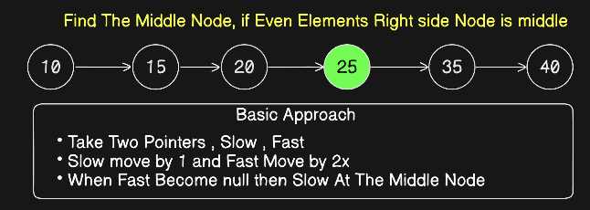
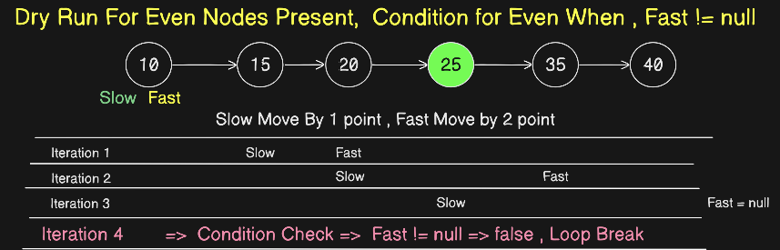
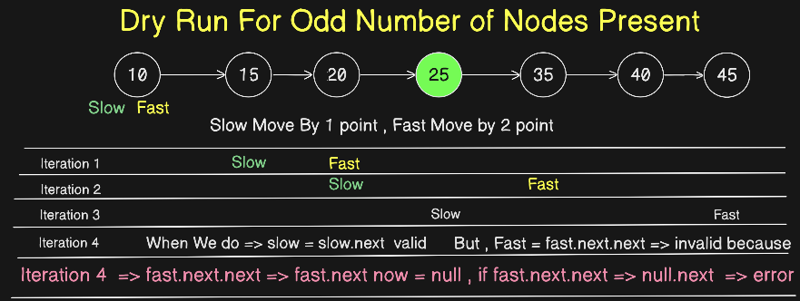
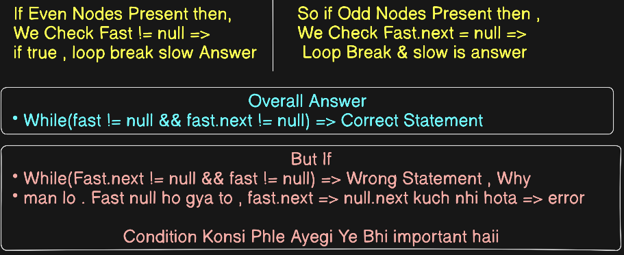
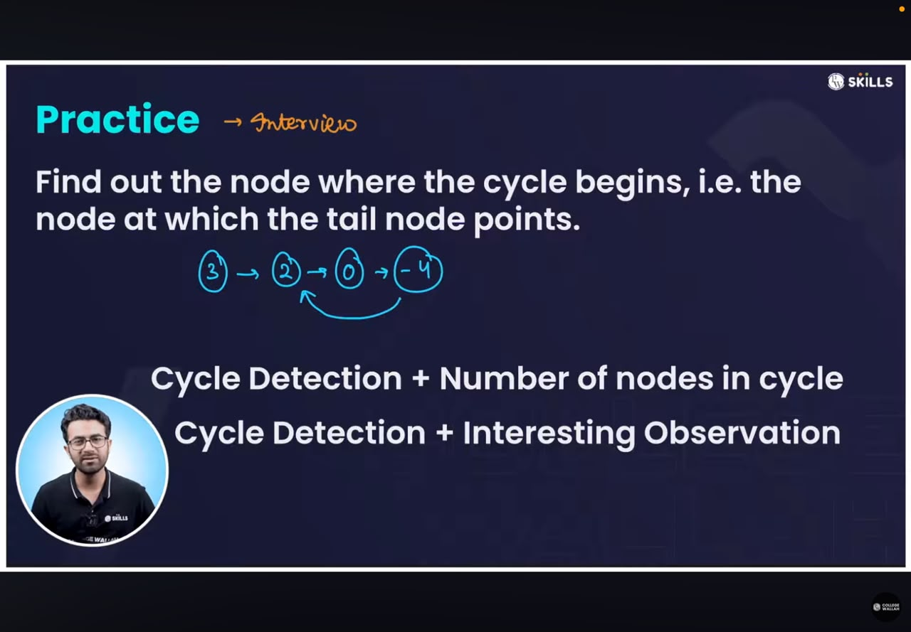

# Day 3 - Questions

## Question No - 4


These Questions Dry Run Must<br> 
First try on pen paper then write code <br>
Constraints -> as per leetcode
- if LL is head only
- Leetcode Question 876


```java
class Solution {
    public ListNode middleNode(ListNode head) {
        ListNode slow = head;
        ListNode fast = head;
        while (fast != null && fast.next != null){
            slow = slow.next;
            fast = fast.next.next;
        }
        return slow;
    }
}
```










## Question 5


