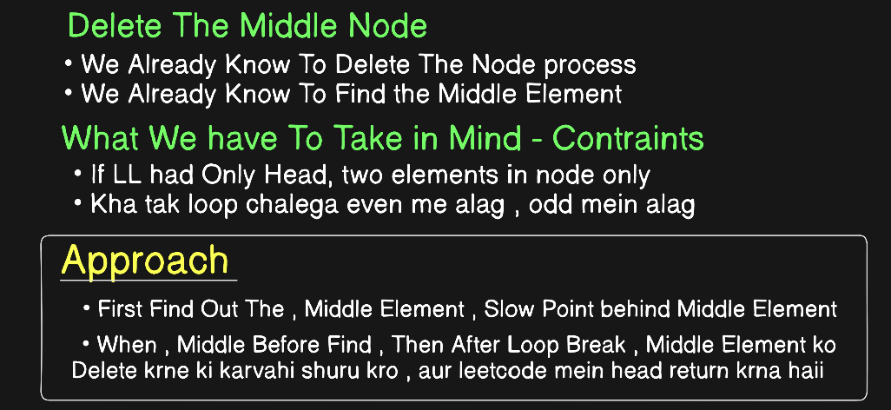
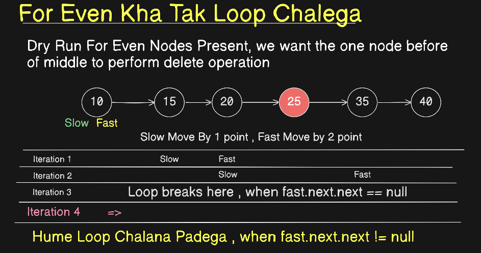
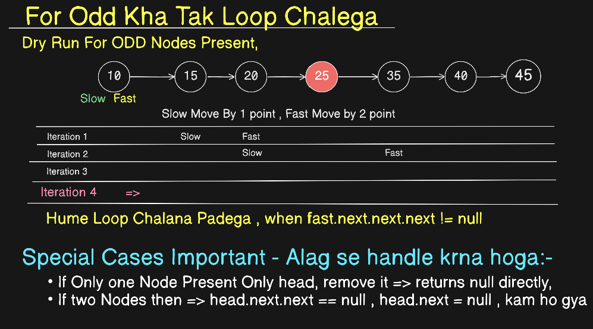
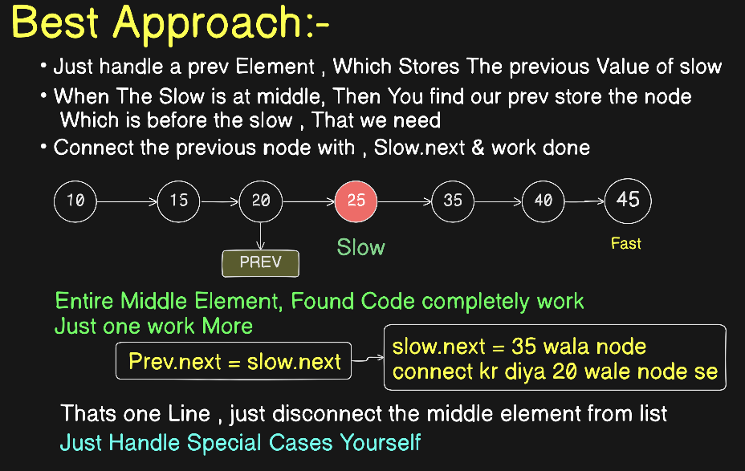

# Day 3 - Questions

## Question No - 4


These Questions Dry Run Must<br> 
First try on pen paper then write code <br>
Constraints -> as per leetcode
- if LL is head only
- Leetcode Question 876


```java
class Solution {
    public ListNode middleNode(ListNode head) {
        ListNode slow = head;
        ListNode fast = head;
        while (fast != null && fast.next != null){
            slow = slow.next;
            fast = fast.next.next;
        }
        return slow;
    }
}
```


## Question 5




```java
class Solution {
    public ListNode deleteMiddle(ListNode head) {
        ListNode slow = head;
        ListNode fast = head;
        // when only one node present in list
        if(head.next == null){
            return null;
        }
        // when only two node present in list
        if(head.next.next == null){
            head.next = null;
            return head;
        }
        
        // for other cases
        while(fast.next.next != null && fast.next.next.next != null){
            slow = slow.next;
            fast = fast.next.next;
        }
        // for deleting the node
        slow.next = slow.next.next;
        return head;
    }
}
```




## Best Approach , To Delete Middle Node


**We Can Do this Question By One Way more, no complexity announce in it ,, just store the previous Value of slow and when slow pahauch jayga middle tak , to uske previous wala element store rahega, so just uska next directly prev.next = slow.next , hogya question khtm; purana wala question same to same use , for finding middle element**

### most satisfied approach, directly use middle element find approach and do it , no worry 
```java
class Solution {
    public ListNode deleteMiddle(ListNode head) {
        if (head == null || head.next == null) {
            return null; // 0 or 1 node -> deleting "the middle" empties the list
        }

        // just store the prev slow value 
        ListNode slow = head;
        ListNode fast = head;
        ListNode prev = null;

        while (fast != null && fast.next != null) {
            prev = slow;
            slow = slow.next;
            fast = fast.next.next;
        }

        prev.next = slow.next; // unlink the middle node — nothing else to touch

        return head;
    }
}
```


