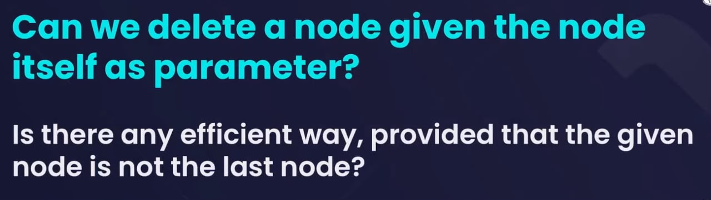
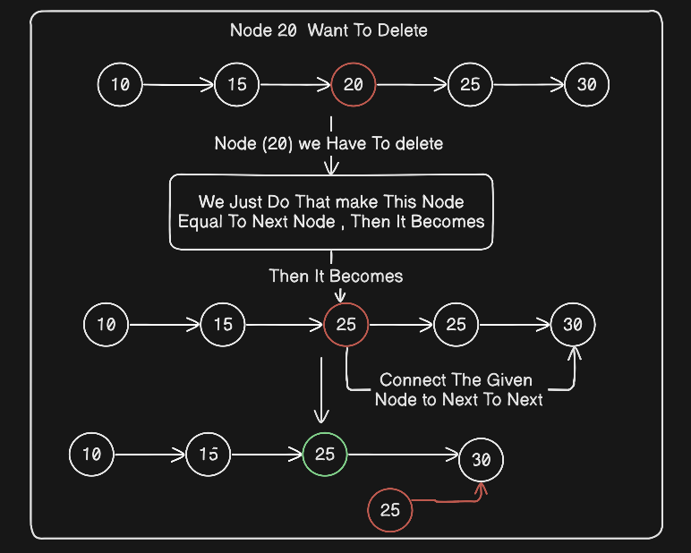
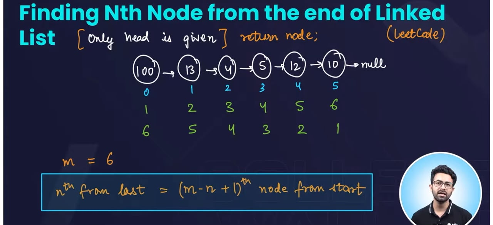
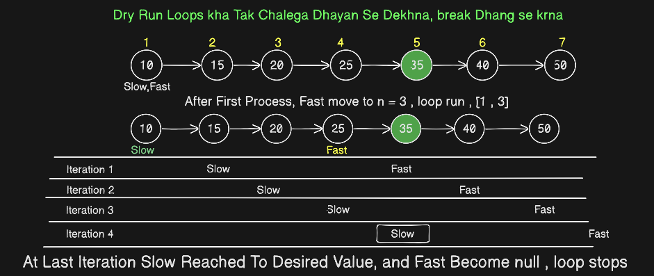
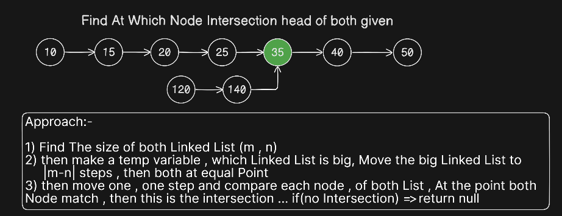

# Question Dry Run And Approach

## Question 1 


Jo Node Address Diya haii Usi, Node ko delete krna haii , agle wale ki replica bna do khud ko , aur agle wale ko hta do 

### dry Run + Approach


```java
    static void deleteItselfNode(NodeList deleteNode){
        deleteNode.val = deleteNode.next.val;
        deleteNode.next = deleteNode.next.next;
    }
```
- We can't Delete The tail, head to last node -1 tak delete kr sakte haii

## Question 2 



### Code Part
```java

    static NodeList getNthNodeFromLast(NodeList head, int nth){
        NodeList slow = head;
        NodeList fast = head;
        // move n steps given 
        for(int i = 1; i <= nth; i++){
            fast = fast.next;
        }
        // after that only one step and fast become null stop
        while(fast != null){
            slow = slow.next;
            fast = fast.next;
        }
        System.out.println(slow.val);
        return slow;

    }
```

### Dry Run


## QUESTION - 3 (INTERSECTION NODE OF TWO LIST)


### Approach


```Java
     static NodeList findIntersection(NodeList headA, NodeList headB) {
        NodeList tempA = headA;
        NodeList tempB = headB;

        int sizeListA = 0;
        int sizeListB = 0;

        while (tempA != null) {
            tempA = tempA.next;
            sizeListA++;
        }

        while (tempB != null) {
            tempB = tempB.next;
            sizeListB++;
        }
         tempA = headA;
         tempB = headB;

        int moveValue = Math.abs(sizeListA - sizeListB);

        if (sizeListA > sizeListB) {
            for(int i = 1; i <= moveValue; i++){
                tempA = tempA.next;
            }
        }else{
            for(int i = 1; i <= moveValue; i++){
                tempB = tempB.next;
            }
        }

        NodeList answer =  null ;

        while(tempA != null){
            if(tempA == tempB){
                answer = tempA;
                break;
            }
            tempA = tempA.next;
            tempB = tempB.next;
        }
        return answer;

    }
```

### Dry Run
